# Generative AI with Python

## LLM - Chains

### 5.1 Prompt Templates

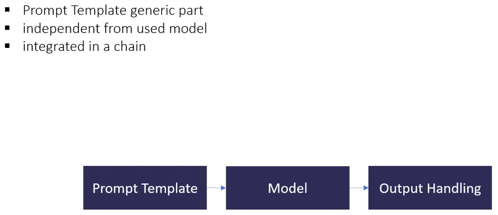

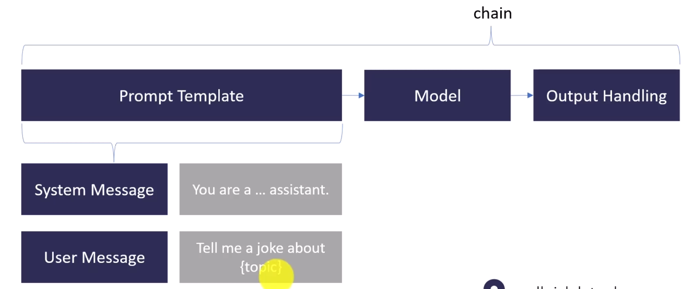

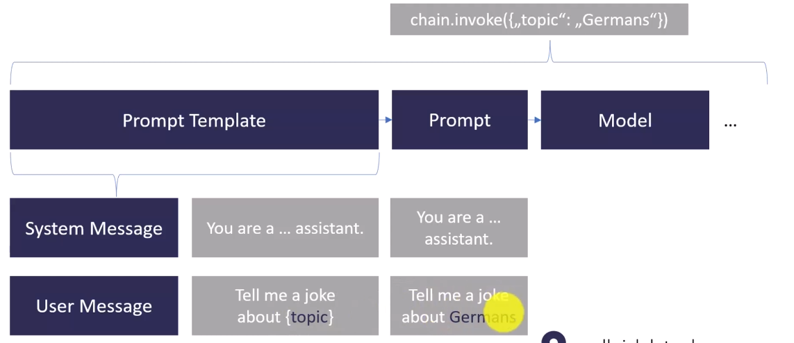

### 5.2 Prompt Hub

[LangChain Hub](https://smith.langchain.com/hub)

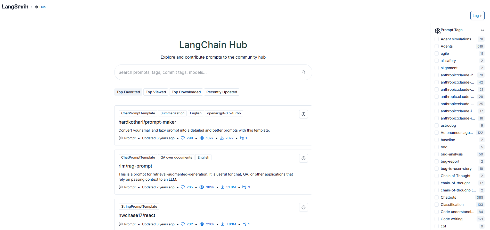

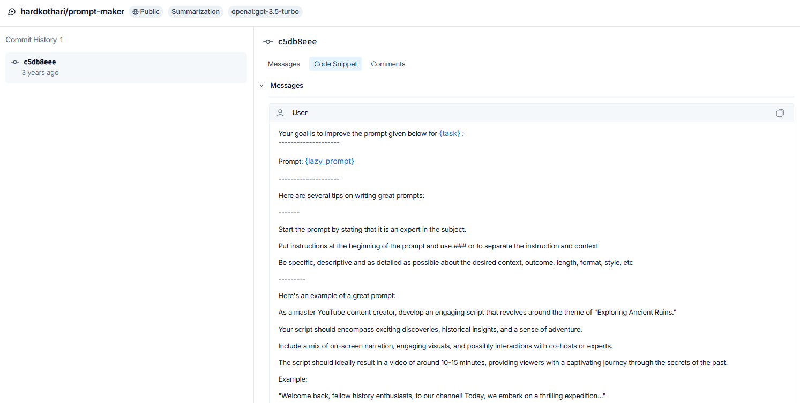

### 5.3 LangChain - Introduction

 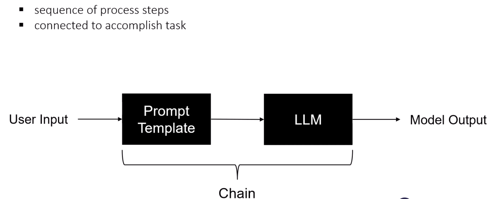

**Parallel Chains**

 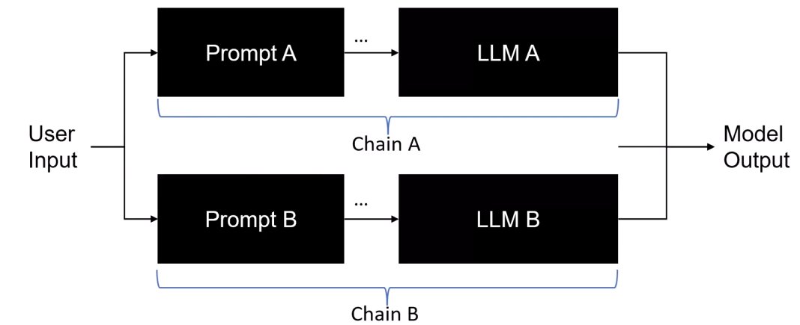

**Router Chains**

 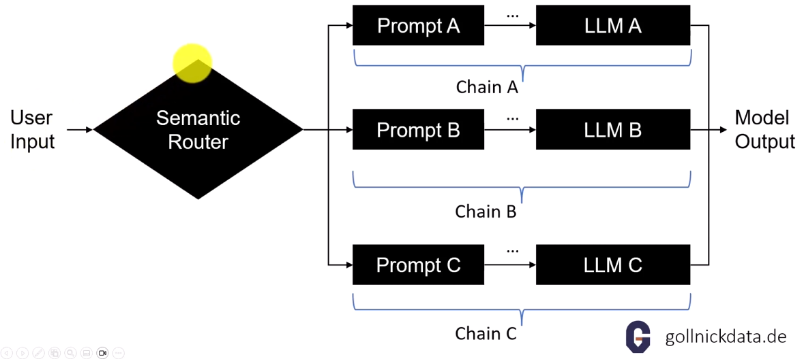

**Chains with Loops and Memory**

 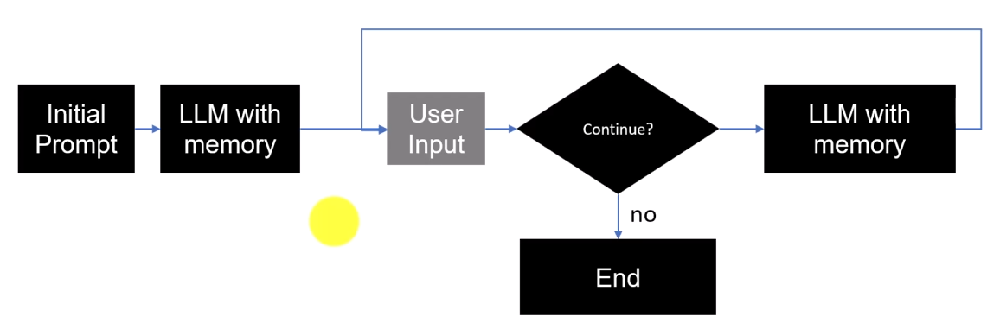

### 5.4 Story Character - Sequential Coding

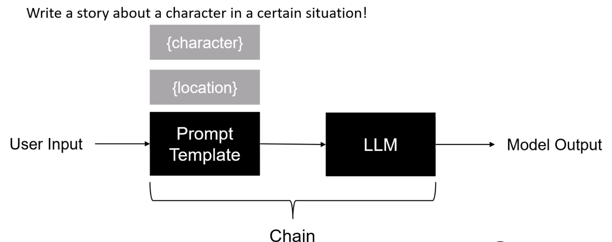

### 5.5 Parallel Chains

 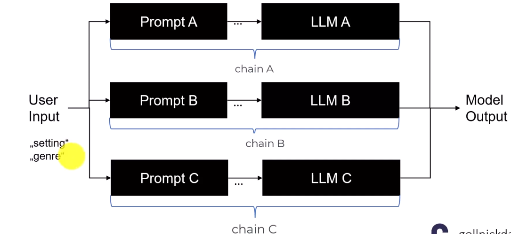

### 5.4 Chains and Structured Output

 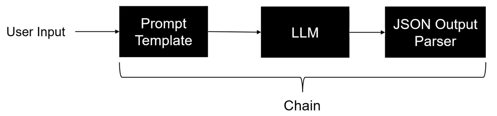

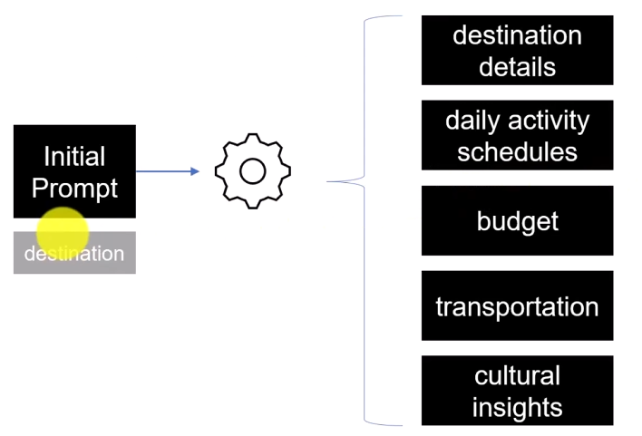
